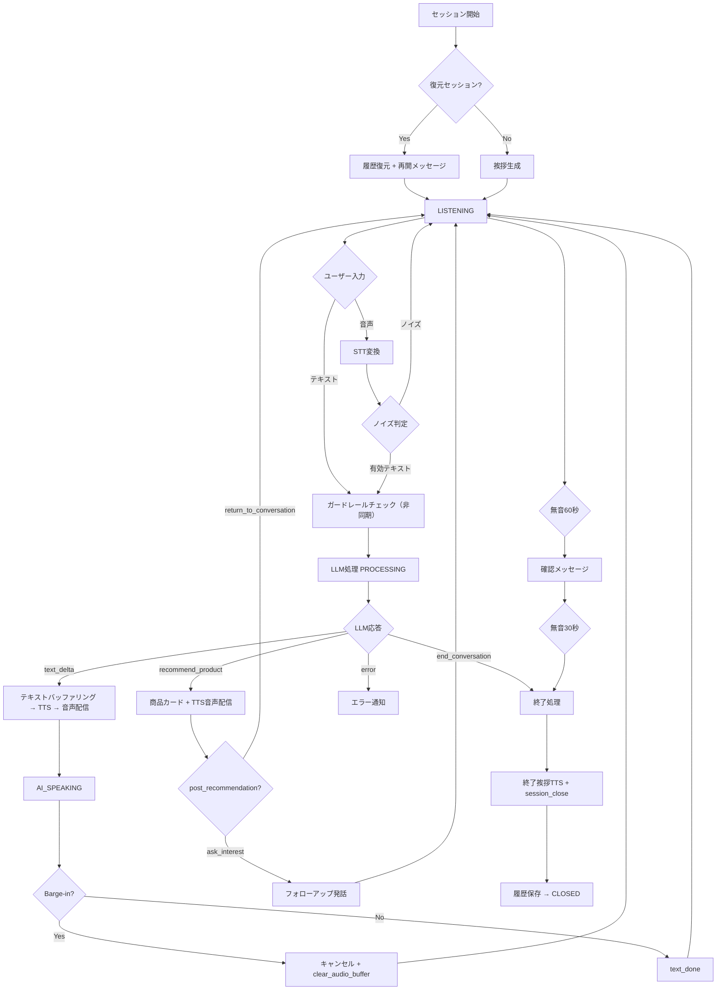

# 音声駆動型・文脈察知式商品紹介アシスタントシステム 詳細設計書 v6.0

## 1. 全体機能要件

### 1.1 システム概要

本システムは、Nuxt 3（フロントエンド）と Go（APIサーバー）間を WebSocket で常時接続し、**OpenAI互換 Chat Completions API（SSEストリーミング）** を用いてリアルタイムのテキスト対話を実現するシステムである。

AIはシステムプロンプトとして渡された固定商品カタログを常時把握し、雑談やヒアリングを通じてユーザーのニーズを察知したタイミングで、**Function Calling（`recommend_product`）を用いて「おすすめ商品」と「ユーザーの文脈に合わせた紹介文言（`introduction_speech`）」を出力**する。

レコメンドは**常に「1回の提案行為」として行う**。1回の提案で紹介するのは単一の商品が基本だが、ユーザーが特定のカテゴリやシリーズに興味を示した場合には、**関連する複数商品をまとめて1回のレコメンドとして紹介**できる（例：「ハイチュウにはグレープ、ストロベリー、グリーンアップルがありますよ！」）。この場合もあくまで「1回の提案」であり、個別のセット販売商品ではない。

また、設定により**指定した複数商品を順番に連続レコメンド**するモードや、**レコメンド後の会話挙動**（通常会話への復帰 or 他商品への関心確認）を切り替えることができる。

ユーザー体験を高めるため**割り込み会話（Barge-in）**および**多角的な会話終了判定・タイムアウト制御**に対応する。AIの発話中にユーザーが割り込んで喋り始めた場合は即座にAI生成をキャンセルし、フロント側の音声再生を停止する。対話完了や放置時には適切なセッション終了処理を行う。

音声出力には外部TTSサービス（**Piper Plus** または **VOICEVOX**）を使用する。Goサーバー側でLLMから受け取ったテキストを文単位にバッファリングし、TTSで音声化してWebSocket経由でブラウザへストリーミング配信する。Function Calling 発火時は `introduction_speech` を直接外部TTSで音声化して配信し、商品カードとともに最速で返す。

音声入力には **Whisper.cpp** によるSTTを使用する。フロントエンドではブラウザマイクからの音声を **RNNoise（WebAssembly）** でノイズ抑制し、**AudioWorklet API** で音声キャプチャした後、48kHz→16kHzにリサンプリングしてサーバーへ送信する。

#### 1.1.1 LLM統合方式

| 項目 | 仕様 |
|:---|:---|
| **API** | OpenAI互換 Chat Completions API |
| **エンドポイント** | `POST {OPENAI_BASE_URL}/chat/completions` |
| **ストリーミング** | SSE（Server-Sent Events）。`data:` 行を逐次パースし `data: [DONE]` で終了 |
| **デフォルトプロバイダ** | Groq（`https://api.groq.com/openai/v1`） |
| **モデル** | 設定画面から動的選択（デフォルト: `gpt-4o-mini`） |
| **Function Calling** | 対応。ツール非対応モデルではHTTP 400レスポンス検知時にツールなしで自動リトライし、以降ツール送信を無効化 |
| **SSEエラー検知** | ストリームデータ内の `"error"` キーを検出し、`error` イベントとして上位に伝搬 |

#### 1.1.2 テキストバッファリング戦略

LLMからのテキストストリームに対し、Go サーバー側では以下のルールでバッファリングしてTTSに送信する：

| ルール | 条件 |
|:---|:---|
| **文境界フラッシュ** | 「。」「！」「？」「…」で区切られた日本語テキストを1ユニットとして送信 |
| **文字数オーバーフロー** | 100文字（rune）以上蓄積された場合に強制送信 |
| **タイムアウト** | 最後のテキスト受信から1秒経過で残りバッファを強制送信 |

#### 1.1.3 外部TTSプロバイダ

| エンジン | 概要 | 対応言語 |
|:---|:---|:---|
| **Piper Plus** | 軽量ニューラルTTS。複数モデル・話者対応 | 日本語・英語・中国語・スペイン語・フランス語・ポルトガル語 |
| **VOICEVOX** | 日本語高品質音声合成エンジン | 日本語 |

---

### 1.2 レコメンドの基本方針

#### 1.2.1 「1回の提案」の定義

本システムにおけるレコメンドは、常に**1回の提案行為**として実行される。1回の `recommend_product` FC 発火に対して、フロントエンドへの商品カード配信と TTS 音声配信を1セットとして行う。

| パターン | 説明 | 例 |
|:---|:---|:---|
| **単一商品の紹介** | ユーザーのニーズに最も合う1商品を紹介 | 「酸っぱいのがお好きでしたら、グリーンアップル味がおすすめですよ！」 |
| **関連商品のまとめ紹介** | ユーザーが特定のカテゴリ・シリーズに興味を示した場合、関連する複数商品をまとめて紹介 | 「ハイチュウにはグレープ、ストロベリー、グリーンアップルの3種類がありますよ！」 |

#### 1.2.2 まとめ紹介とセット販売の違い

まとめ紹介は**AIが文脈に応じて関連商品を並べて紹介する行為**であり、カタログ上のセット販売商品とは異なる。各商品はカタログ上で独立した単品として存在する。商品の選択・購入機能は本システムのスコープ外であり、音声対話による商品紹介と情報提供を目的とする。

---

### 1.3 セッション設定

#### 1.3.1 レコメンドモード (`recommendation_mode`)

| モード値 | 説明 | 動作 |
|:---|:---|:---|
| **`ai_driven`** (デフォルト) | AIが会話文脈から判断して自発的にレコメンド | AIの FC 発火に任せる |
| **`sequential`** | 指定した商品リストを順番に連続レコメンド | Go サーバーが商品キューを管理し、1つのレコメンド完了後に次の商品をレコメンドする |

#### 1.3.2 順次レコメンドモード (`sequential`) の詳細

`sequential` モード有効時、Go サーバーはセッション設定で渡された商品IDリスト（またはまとめ紹介用の商品IDグループ）を内部キュー（`seqIndex`）として保持する。

```json
{
  "recommendation_mode": "sequential",
  "sequential_items": [
    { "product_ids": ["h001"] },
    { "product_ids": ["h002"] },
    { "product_ids": ["h001", "h002", "h003"] }
  ],
  "sequential_interval_sec": 5
}
```

#### 1.3.3 レコメンド後挙動 (`post_recommendation_behavior`)

| 設定値 | 説明 | AIの発話イメージ |
|:---|:---|:---|
| **`return_to_conversation`** (デフォルト) | 通常の雑談・対話に戻る | — |
| **`ask_interest`** | 他に気になる商品がないか明示的に確認 | 「ご紹介した商品はいかがですか？気になるものはありましたか？」 |

#### 1.3.4 セッション設定の全体構造

```json
{
  "recommendation_mode": "ai_driven | sequential",
  "sequential_items": [
    { "product_ids": ["h001"] },
    { "product_ids": ["h001", "h002", "h003"] }
  ],
  "sequential_interval_sec": 5,
  "post_recommendation_behavior": "return_to_conversation | ask_interest"
}
```

---

### 1.4 要求事項に紐づく機能要件

| ID | 分類 | 機能要件名 | 詳細説明 | 実装状態 |
|:---|:---|:---|:---|:---|
| **FR-01** | 対話制御 | リアルタイムテキスト対話 & 外部TTS | Chat Completions API（SSE）からテキストストリームを受け取り、文単位バッファリング後にPiper/VOICEVOXで音声化・配信 | ✅ 実装済 |
| **FR-02** | 状態察知 | 興味・ニーズの文脈察知 | AIはシステムプロンプトの指示に基づき、ユーザーが商品に興味を持ち始めたタイミングを自発的に判定 | ✅ 実装済 |
| **FR-03** | カタログ制御 | 商品レコメンド (FC) | `recommend_product` Function Calling で商品ID（単一または複数）と `introduction_speech` を受け取り、商品カードと音声を配信 | ✅ 実装済 |
| **FR-03a** | カタログ制御 | 関連商品のまとめ紹介 | `product_ids` 配列で複数商品をまとめて1回の提案として紹介可能 | ✅ 実装済 |
| **FR-03b** | カタログ制御 | 順次レコメンドモード | 指定商品リストを順番にレコメンド。`seqIndex` でキュー位置を管理 | ✅ 実装済 |
| **FR-03c** | 対話制御 | レコメンド後挙動設定 | `return_to_conversation` または `ask_interest` で切替可能 | ✅ 実装済 |
| **FR-04** | 最適化 | FC発火時の二重発話防止 | FC発火時は `introduction_speech` を直接TTSで音声化。テキストバッファをリセットし重複を防止 | ✅ 実装済 |
| **FR-05** | 割り込み制御 | 割り込み会話 (Barge-in) 対応 | AI発話中にユーザー入力を検知した場合、LLM/TTSパイプラインをキャンセルし `clear_audio_buffer` を送信 | ✅ 実装済 |
| **FR-06** | 会話管理 | 会話終了判定 & タイムアウト | `end_conversation` FC、手動切断、2段階無音タイマー（60秒+30秒）による切断制御 | ✅ 実装済 |
| **FR-07** | 安全性 | 非同期ガードレール監視 | ユーザー発話テキストおよびAI生成テキストをLLMベースのモデレーションで非同期チェック。違反時は `content_violation` イベントを配信 | ✅ 実装済 |

---

### 1.5 Function Calling 定義

#### 1.5.1 recommend_product

| パラメータ | 型 | 必須 | 説明 |
|:---|:---|:---|:---|
| `product_ids` | `string[]` | ✅ | 紹介する商品IDのリスト。設定済み商品IDから選択（`enum` で制限） |
| `introduction_speech` | `string` | ✅ | 商品を紹介するトーク文言 |

**発火条件**（`ai_driven` モード時）:
1. ユーザーが商品の品番・名前を明示的に問い合わせた場合
2. ユーザーが好みや用途を述べ、該当商品が存在する場合
3. ユーザーが直接的におすすめを求めた場合
4. 前回の提案に対してユーザーが否定・別案を求めた場合

**発火禁止条件**: 商品と無関係な雑談中 / カタログに該当商品なし

#### 1.5.2 end_conversation

| パラメータ | 型 | 必須 | 説明 |
|:---|:---|:---|:---|
| `closing_speech` | `string` | ✅ | お別れの挨拶文言 |

---

### 1.6 非同期ガードレール監視 (FR-07)

| 項目 | 仕様 |
|:---|:---|
| **方式** | LLMベースモデレーション（Chat Completions APIを使用） |
| **モデル** | `llama-3.1-8b-instant`（Groq） |
| **チェック対象** | ユーザー入力テキスト、AI生成テキスト（完了時） |
| **実行** | 非同期（`go m.checkGuardrail(text)`） |
| **タイムアウト** | 5秒 |
| **検出カテゴリ** | ヘイトスピーチ、性的コンテンツ、暴力・自傷脅迫、PII悪用、違法行為指示 |
| **違反時処理** | `content_violation` イベントをフロントエンドに配信 |
| **フォールバック** | API未設定時（キーなし）またはエラー時はパス（安全側に倒す） |

---

### 1.7 会話終了・セッション管理

#### 1.7.1 終了トリガー

| トリガー | 説明 |
|:---|:---|
| **FC `end_conversation`** | AIが会話終了を判断し、`closing_speech` とともにFC発火 |
| **2段階無音タイムアウト** | 60秒無音→確認メッセージ→さらに30秒無音→自動終了 |
| **UI手動操作** | ユーザーが「切断」ボタンをクリック |

#### 1.7.2 2段階無音タイマー

```
[LISTENING] ──60秒無音──> [STAGE 1: 確認メッセージ送信]
                           「まだいらっしゃいますか？」
                           ──30秒無音──> [STAGE 2: セッション終了]
```

- ユーザーの発話やテキスト入力でタイマーリセット
- AI発話中はタイマー一時停止、発話完了後に再開
- 一時停止中に経過した時間は記録され、再開時に残り時間から再開

#### 1.7.3 終了時の処理

1. `silenceTimer.Stop()` でタイマー停止
2. 終了理由に応じた挨拶メッセージをTTSで音声化・送信
3. `session_close` イベント送信
4. 会話履歴を `data/history/` にJSON保存
5. LLMクライアント・WebSocket接続をクローズ

---

### 1.8 セッション状態遷移

```
┌────────┐
│  idle  │───────────────────────────────┐
└───┬────┘                               │
    │                                     │
    ▼                                     ▼
┌──────────┐    ┌────────────┐    ┌──────────┐
│listening │───>│ processing │───>│ai_speaking│
└────┬─────┘    └─────┬──────┘    └─────┬────┘
     │                │                  │
     │    ◄───────────┘     ◄───────────┘
     │    (barge-in / done)
     ▼
┌─────────┐    ┌────────┐
│ closing │───>│ closed │
└─────────┘    └────────┘
```

| 状態 | 説明 |
|:---|:---|
| `idle` | 初期状態 |
| `listening` | ユーザー入力待ち |
| `processing` | LLM処理中 |
| `ai_speaking` | AI発話中（TTS再生中） |
| `closing` | セッション終了処理中 |
| `closed` | 終了（端末状態） |

---

## 2. 画面設計書

### 2.1 音声対話コンシェルジュ画面 (`/assistant`)

#### 2.1.1 レイアウト構成

```
┌─────────────────────────────────────────────┐
│ [ヘッダー]                                    │
│  おためしちゃん [接続バッジ] [音量] [履歴] [設定] [接続/切断] │
├─────────────────────────────────────────────┤
│ [ステータスバー]                               │
│  状態表示  セッションID  [復元セッション] [新規会話]│
├─────────────────────────────────────────────┤
│                                             │
│ [対話タイムライン]                              │
│  - AI発話（左寄せ）                            │
│  - ユーザー発話（右寄せ）                       │
│  - 商品カード                                 │
│  - レイテンシ情報                              │
│                                             │
├─────────────────────────────────────────────┤
│ [入力エリア]                                   │
│  [テキスト/マイク切替] [テキスト入力欄] [送信]    │
│  または                                      │
│  [テキスト/マイク切替] [マイクボタン] [状態テキスト]│
└─────────────────────────────────────────────┘
```

#### 2.1.2 入力モード

| モード | UI要素 | 説明 |
|:---|:---|:---|
| **テキスト** | テキスト入力欄 + 送信ボタン | Enterキーで送信。入力欄の左にモード切替トグル |
| **マイク** | マイクボタン（丸型） | タップで音声認識開始/停止。ボタン左にモード切替トグル。音量メーター表示 |

モード切替は入力エリアのトグルスイッチで行う。

#### 2.1.3 セッション復元

会話履歴から復元したセッションでは:
- ステータスバーに「復元セッション」ラベルを表示
- 「新規会話」ボタンを表示（クリックで新しいセッションを開始）
- 復元時は過去の会話ログがタイムラインに表示され、AIが「前回の会話の続きですね」と発話

#### 2.1.4 商品カード

| レイアウト | 条件 |
|:---|:---|
| 中央1枚 | 単一商品紹介 |
| 横並び | まとめ紹介（PC: 3枚 / タブレット: 2枚 / スマホ: スワイプ） |

各カードに画像・商品名・価格・説明を表示。

### 2.2 設定画面 (`/settings`)

| セクション | 設定項目 |
|:---|:---|
| **システムプロンプト** | AIの役割・話し方・会話方針 |
| **LLM** | モデル選択（API `/models` から動的取得） |
| **TTS** | エンジン（Piper/VOICEVOX）、ボイス、話者ID、言語、話速、ノイズパラメータ |
| **STT** | 認識言語、Initial Prompt（固有名詞ヒント） |
| **取扱商品** | 商品の追加・編集・削除（ID、名前、価格、説明、画像URL） |

### 2.3 会話履歴画面 (`/history`)

- 左ペイン: セッション一覧（日時、ターン数、プレビュー）
- 右ペイン: 選択セッションの全会話ログ
- 「この会話から再開」ボタンでアシスタント画面に遷移（`?restore={session_id}`）

---

## 3. API設計書

### 3.1 WebSocket API

**エンドポイント**: `ws://{host}:{port}/ws`

**クエリパラメータ**:

| パラメータ | 説明 |
|:---|:---|
| `restore_session_id` | 復元するセッションのUUID |
| `recommendation_mode` | レコメンドモード |
| `post_recommendation_behavior` | レコメンド後挙動 |

**Ping/Pong キープアライブ**:
- サーバーから30秒間隔でPingを送信
- クライアントのPong応答で読み取りデッドラインを90秒に更新

#### 3.1.1 クライアント→サーバー（Inbound）

| Type | ペイロード | 説明 |
|:---|:---|:---|
| `audio_chunk` | `{text?, audio_data?, duration_ms?}` | テキスト入力またはオーディオチャンク |
| `audio_speech` | `{audio}` | Base64 PCM音声データ（16kHz, 16bit, mono）。サーバー側でSTT処理 |
| `session_control` | `{action, reason?, config?}` | `action: "close"` でセッション終了要求 |

#### 3.1.2 サーバー→クライアント（Outbound）

| Type | ペイロード | 説明 |
|:---|:---|:---|
| `connection_state` | `{state, session_id}` | 接続確立通知 |
| `text_delta` | `{text}` | LLMテキストストリーム断片（文単位） |
| `text_done` | `{text, audio_chunk?, is_final, latency?}` | テキスト完了通知。`latency` に計測情報 |
| `audio_stream` | `{audio, sentence_id, is_final?}` | TTS音声チャンク（Base64 Opus） |
| `product_recommendation` | `{transcript, audio_chunk?, products[]}` | 商品レコメンド |
| `clear_audio_buffer` | `{reason}` | 音声バッファクリア指示（barge-in時） |
| `user_transcript` | `{text, skipped?}` | STT結果通知 |
| `content_violation` | `{reason, message}` | ガードレール違反通知 |
| `error` | `{code, message, recoverable}` | エラー通知 |
| `session_close` | `{reason, message}` | セッション終了通知 |
| `history_restore` | `{messages[{role, content}]}` | 復元履歴データ |

**LatencyInfo構造体**:

```json
{
  "stt_ms": 0,
  "llm_ttfb_ms": 287,
  "llm_total_ms": 347,
  "tts_ms": 210,
  "total_ms": 509
}
```

### 3.2 REST API

| メソッド | パス | 説明 |
|:---|:---|:---|
| `GET` | `/api/config` | 現在の設定を取得 |
| `PUT` | `/api/config` | 設定を更新（1MB制限） |
| `GET` | `/api/models` | 利用可能なLLMモデル一覧を取得 |
| `GET` | `/api/tts/voices` | 利用可能なTTSボイス一覧を取得 |
| `GET` | `/api/history` | セッション履歴一覧を取得 |
| `GET` | `/api/history/{id}` | 特定セッションの詳細を取得（UUID形式のバリデーション付き） |
| `GET` | `/health` | ヘルスチェック |

**CORS設定**: `CORS_ORIGIN` 環境変数（デフォルト: `http://localhost:3000`）。WebSocket `CheckOrigin` も同一オリジンを検証。

### 3.3 外部TTS API

#### Piper Plus

```
POST {TTS_URL}/synthesize
Content-Type: application/json

{
  "text": "こんにちは",
  "voice": "base_6lang",
  "speaker_id": 0,
  "language": "ja",
  "length_scale": 1.25,
  "noise_scale": 0.667,
  "noise_w": 0.8
}
```

レスポンス: WAV音声 → Opus変換後にクライアントへ配信

**言語別デフォルト話者ID**: ja=0, en=20, zh=330, es=472, fr=535, pt=563

#### VOICEVOX

```
# Step 1: 音声クエリ生成
POST {VOICEVOX_URL}/audio_query?text={text}&speaker={speaker_id}

# Step 2: 音声合成
POST {VOICEVOX_URL}/synthesis?speaker={speaker_id}
Content-Type: application/json
Body: {Step 1のレスポンス（speedScale適用後）}
```

### 3.4 STT API (Whisper.cpp)

```
POST {STT_URL}/inference
Content-Type: multipart/form-data

file: audio.wav (16kHz, 16bit, mono)
response_format: verbose_json
temperature: 0.0
language: {config値 or 省略(auto)}
prompt: {config stt_prompt}
```

レスポンス: `{text, language}`

---

## 4. 音声入力パイプライン

### 4.1 フロントエンド音声キャプチャ

```
[ブラウザマイク] ──48kHz──> [AudioWorklet] ──> [RNNoise(WASM)]
    ──ノイズ抑制済──> [VAD(音量閾値)]
    ──発話検出──> [PCMバッファ蓄積]
    ──無音700ms──> [OfflineAudioContext 48→16kHz リサンプリング]
    ──Base64 PCM──> [WebSocket audio_speech]
```

| パラメータ | 値 |
|:---|:---|
| キャプチャレート | 48,000 Hz（RNNoise要件） |
| STTレート | 16,000 Hz |
| 無音閾値 | RMS 0.015 |
| 無音フレーム数 | 30フレーム（≈700ms） |
| 最小発話フレーム | 5フレーム |
| ノイズ抑制 | RNNoise（@shiguredo/rnnoise-wasm） |

### 4.2 サーバー側STT処理

1. Base64 PCMデータをデコード
2. PCM → WAV形式に変換（ヘッダー付加）
3. Whisper.cpp `/inference` エンドポイントへ送信
4. ノイズテキストフィルタリング（誤認識パターン除外、3文字以下除外）
5. 検出言語を記録（TTS言語自動追従用）

---

## 5. 設定管理

### 5.1 設定ファイル (`data/config.yaml`)

```yaml
system_prompt: |-
  [Personal]
  私は「おためしちゃん」というアシスタントです。
  ...
llm_model: llama-3.1-8b-instant
tts_engine: piper
tts_voice: base_6lang
tts_speaker_id: 0
tts_language: ja
tts_length_scale: 1.25
tts_noise_scale: 0.667
tts_noise_w: 0.8
voicevox_speaker_id: 1
voicevox_speed_scale: 1.2
stt_language: ja
stt_prompt: ""
products:
  - id: h001
    name: ハイチュウ グレープ
    price: 140
    description: ...
```

### 5.2 環境変数

| 変数 | 説明 | デフォルト |
|:---|:---|:---|
| `LLM_MODE` | LLMモード（`stub` / `chat`） | `stub` |
| `OPENAI_API_KEY` | LLM APIキー | — |
| `OPENAI_BASE_URL` | LLM APIエンドポイント | `https://api.openai.com/v1` |
| `OPENAI_MODEL` | LLMモデル（config優先） | `gpt-4o-mini` |
| `TTS_URL` | Piper TTS URL | — |
| `TTS_ENGINE` | TTSエンジン（config優先） | `piper` |
| `VOICEVOX_URL` | VOICEVOX URL | `http://voicevox:50021` |
| `STT_URL` | Whisper STT URL | — |
| `STT_LANGUAGE` | STT言語（config優先） | `ja` |
| `CONFIG_PATH` | 設定ファイルパス | `data/config.yaml` |
| `CORS_ORIGIN` | CORS許可オリジン | `http://localhost:3000` |
| `PORT` | バックエンドポート | `8080` |
| `LOG_PATH` | ログファイルパス | — |
| `LOG_LEVEL` | ログレベル | `info` |

---

## 6. サービス構成

### 6.1 Docker Compose サービス一覧

| サービス | ポート | 役割 | 依存 |
|:---|:---|:---|:---|
| `frontend` | 3000 | Nuxt 3 SPA（音声入力UI、会話表示） | backend |
| `backend` | 8080 | Go WebSocket APIサーバー（マルチステージビルド） | tts, voicevox, stt |
| `tts` | 5000 | Piper Plus TTS（多言語対応） | — |
| `voicevox` | 50021 | VOICEVOX TTS（日本語高品質音声） | — |
| `stt` | 8888 | Whisper.cpp STT | — |

### 6.2 ヘルスチェック

| サービス | チェック方法 | 間隔 | 起動猶予 |
|:---|:---|:---|:---|
| `tts` | HTTP GET `/health` | 10s | — |
| `voicevox` | wget `/version` | 10s | 120s |
| `stt` | curl `/health` | 10s | 60s |

---

## 7. ディレクトリ構成

```
├── backend/                  # Go バックエンド
│   ├── cmd/server/           # エントリポイント (main.go)
│   ├── internal/
│   │   ├── catalog/          # 商品カタログ管理
│   │   ├── config/           # 設定管理 (YAML永続化, mutex保護)
│   │   ├── guardrail/        # コンテンツモデレーション (LLMベース)
│   │   ├── handler/          # HTTP/WS ハンドラ
│   │   ├── history/          # 会話履歴保存 (JSON)
│   │   ├── logging/          # ログ設定
│   │   ├── openai/           # LLM クライアント (Chat Completions SSE)
│   │   ├── protocol/         # WebSocket メッセージ定義
│   │   ├── session/          # セッション管理・状態遷移・無音タイマー
│   │   ├── stt/              # 音声認識 (Whisper.cpp)
│   │   ├── textbuf/          # テキストバッファ（文単位分割）
│   │   └── tts/              # 音声合成 (Piper/VOICEVOX/Stub)
│   ├── data/                 # 設定・履歴データ
│   ├── Dockerfile            # マルチステージビルド (golang:1.23-alpine → alpine:3.20)
│   └── entrypoint.sh
├── frontend/                 # Nuxt 3 フロントエンド (SPA, ssr: false)
│   ├── pages/                # assistant, settings, history, index
│   ├── composables/          # useSession, useWebSocket, useVoiceInput,
│   │                         # useAudioPlayback, useAudioCapture,
│   │                         # useNoiseSuppression, useAppSettings
│   ├── components/           # ConnectionBadge, StatusIndicator,
│   │                         # ConversationTimeline, ProductCard,
│   │                         # ProductCardList, VolumeMeter, ErrorBanner,
│   │                         # SessionConfigPanel
│   └── types/                # TypeScript 型定義
├── tts/                      # Piper Plus TTS サーバー (Python)
├── stt/                      # Whisper.cpp STT サーバー
├── docs/                     # ドキュメント
└── docker-compose.yml
```

---

## 8. セキュリティ

| 対策 | 実装 |
|:---|:---|
| **CORS制御** | `CORS_ORIGIN` 環境変数によるオリジン制限 |
| **WebSocket CheckOrigin** | CORS_ORIGINと同一のオリジン検証 |
| **リクエストボディ制限** | 設定API: 1MB (`io.LimitReader`) |
| **入力バリデーション** | 履歴APIのセッションID: UUID正規表現チェック |
| **APIキー保護** | `.env` ファイルに格納、`.gitignore` で除外 |
| **コンテンツモデレーション** | LLMベースの非同期ガードレール監視 |
| **同時書き込み保護** | gorilla/websocket の書き込みは単一ゴルーチン（sendCh経由） |
| **設定ロック** | config の Load/Get/Update は mutex で保護 |

---

## 9. 会話フローチャート



---

**ドキュメントバージョン**: v6.0
**最終更新**: 2026-08-05
**前バージョンからの主な変更点**:
- OpenAI Realtime API → Chat Completions API（SSEストリーミング）に変更
- TTS: 未決定 → Piper Plus / VOICEVOX 実装済
- STT: Whisper.cpp 実装済
- ガードレール: OpenAI Moderation API → LLMベースモデレーション
- 無音タイマー: 60秒 + 30秒
- 音声キャプチャ: AudioWorklet API + RNNoise（WASM）
- セッション復元時の「新規会話」ボタン追加
- 入力モード切替をステータスバーから入力エリアに移動
- マルチステージDockerビルド導入
- WebSocket Ping/Pongキープアライブ追加
